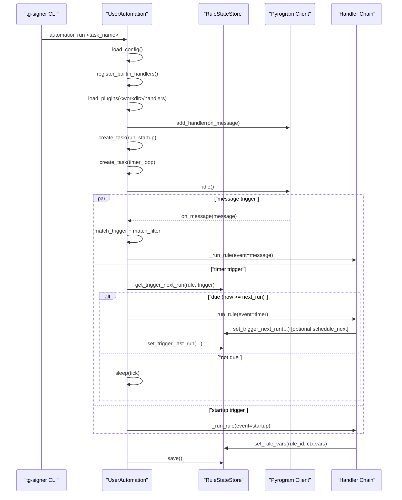

# Automation 设计文档

## 1. 文档目标

本文用于说明 `tg_signer/automation` 子系统的设计与运行机制，帮助开发者在不依赖作者口头说明的情况下，快速完成以下任务：

- 理解消息触发、定时触发、启动触发的执行流程。
- 理解规则状态（`state.json`）的读写边界与语义。
- 在不破坏现有行为的前提下新增/调整 handler、插件或配置结构。
- 在线上问题中快速定位“未触发、误触发、重复触发、变量异常”等问题。

## 2. 模块与职责

自动化子系统由 4 个核心文件组成：

- `tg_signer/automation/engine.py`
  - 主执行器 `UserAutomation`。
  - 负责配置加载、事件监听、定时轮询、规则执行编排。
- `tg_signer/automation/handlers.py`
  - 内置 handler 注册与调用。
  - 插件 handler 动态加载。
  - 文本模板渲染与输入辅助函数。
- `tg_signer/automation/models.py`
  - `Event`：一次执行的输入事件模型。
  - `AutomationContext`：handler 链共享上下文。
  - `RuleStateStore`：`rule/trigger` 维度状态持久化。
- `tg_signer/config.py`（自动化相关段）
  - `AutomationConfig/RuleConfig/TriggerConfig/...` 等配置模型定义。

## 3. 核心数据模型

### 3.1 Rule 配置模型

每条规则（`RuleConfig`）包含：

- `id`：规则唯一标识（状态持久化主键的一部分）。
- `enabled`：是否启用。
- `triggers`：触发器列表（`message/timer/startup`）。
- `filters`：过滤器（可选）。
- `handlers`：动作链（按顺序执行）。
- `vars`：规则级默认变量。

### 3.2 Event 运行时模型

`Event` 为单次触发执行的输入载体，关键字段：

- `type`：`message/timer/startup`。
- `chat_id`：当前事件目标会话。
- `message`：消息事件时的原始消息对象（非消息触发则为空）。
- `now`：触发时间。
- `trigger_id`：触发器唯一标识（配置 `id` 或 `rule_id:index`）。
- `rule_id`：当前规则 ID。

### 3.3 状态存储模型

状态文件路径：`<workdir>/automations/<task>/state.json`。

结构示例：

```json
{
  "rules": {
    "cooldown_rule": {
      "vars": {
        "x": "5",
        "ai_text": "..."
      },
      "triggers": {
        "timer1": {
          "next_run_at": "2026-03-02T18:00:00+08:00",
          "last_run_at": "2026-03-02T17:55:00+08:00"
        }
      }
    }
  }
}
```

`RuleStateStore` 约束：

- 以 `rules.<rule_id>.vars` 持久化规则变量。
- 以 `rules.<rule_id>.triggers.<trigger_id>` 持久化定时元数据。
- 采用 `_dirty` 标记减少无效 IO（无变更时跳过写盘）。

## 4. 运行时流程

### 4.1 启动入口

CLI 入口：`tg-signer automation run <task_name>`，最终调用 `UserAutomation.run()`。

执行顺序：

1. 登录 Telegram 会话（必要时）。
2. 加载配置（支持 `config.json|yaml|yml`，JSON 优先）。
3. 如配置包含 `ai_reply`，校验 AI 配置。
4. 注册内置 handlers，并加载 `<workdir>/handlers/*.py` 插件。
5. 注册消息监听器 `on_message`。
6. 启动两个异步执行面：
   - `run_startup(...)`：一次性启动触发。
   - `timer_loop()`：持续轮询定时触发。

### 4.2 消息触发链路

`on_message` 对每条入站消息执行：

1. 遍历启用规则。
2. 仅处理 `trigger.type == "message"` 的触发器。
3. 触发器匹配：chat/user/reply 条件。
4. 过滤器匹配：`chat/from_user/text_rule`。
5. 创建 `Event` 并进入 `_run_rule` 执行 handler 链。

### 4.3 定时触发链路

`timer_loop` 每 `tick`（默认 1 秒）轮询：

1. 遍历启用规则中的 timer 触发器。
2. 从 `state.json` 读取 `next_run_at`。
3. 若无 `next_run_at`：
   - 根据 `cron` 或 `interval_seconds` 计算并写入。
4. 若 `now >= next_run_at`：
   - 执行规则。
   - 优先读取 handler（如 `schedule_next`）可能写入的新 `next_run_at`。
   - 若未覆盖，再按 timer 默认配置推导下一次执行时间。
   - 写入 `last_run_at` 并持久化。

### 4.4 启动触发链路

`run_startup` 在进程启动后对每条规则执行一次：

- 仅触发 `trigger.type == "startup"`。
- 不依赖消息输入。
- 适合做初始化任务（如加载状态、发上线通知）。

### 4.5 配置到执行时序图



## 5. Handler 执行语义

统一返回值语义：

- `continue`：继续执行后续 handler。
- `stop`：终止当前规则链。
- `defer`：终止当前规则链（语义上可表示“延后”）。

执行器 `_run_rule` 特性：

- 规则变量初始化：`ctx.vars = rule.vars + state.vars`（后者覆盖前者）。
- handler 串行执行；任一异常会中断当前规则链。
- 链执行结束后统一回写 `ctx.vars` 到状态存储。

## 6. 模板与变量机制

模板渲染函数：`render_template(text, event, ctx)`。

可用变量来源：

- `ctx.vars` 中的规则变量。
- `event` 对象。
- `message` 对象。
- `chat_id`、`now`。

缺失变量不会抛错，会保留为 `{var_name}` 原文（`SafeFormatDict`）。

## 7. 插件机制

插件目录：`<workdir>/handlers/*.py`。

约定：

- 每个插件文件需提供 `HANDLERS` 字典。
- 键为 handler 名称，值为可调用异步函数。
- 与内置 handler 重名会被跳过并告警。

示例：

```python
async def hello(event, ctx, params):
    await ctx.worker.send_message(event.chat_id, "hello")
    return "continue"

HANDLERS = {"my_hello": hello}
```

## 8. 可观测性与日志

当前日志策略：

- `INFO`：
  - 配置加载结果（规则数量、迁移状态）。
  - handler 注册总数、插件加载汇总。
- `DEBUG`：
  - timer 下次执行时间计算与覆盖过程。
  - 消息命中规则信息。
  - handler 逐步执行结果与变量持久化。
  - 关键 handler 参数透传（如发送目标、转发目标、调度时间）。
- `WARNING/ERROR`：
  - 配置/插件异常、handler 缺失、执行异常、非法参数等。

建议排障方式：

1. 开启 DEBUG 日志后复现问题。
2. 先看“是否命中 trigger/filter”。
3. 再看“handler 链在哪一步 stop/异常”。
4. 最后检查 `state.json` 的 `vars` 与 `next_run_at/last_run_at` 是否符合预期。

## 9. 兼容性与演进建议

- 新增自动化能力优先放在 `automation` 子系统，而不是 legacy `monitor`。
- 配置模型变更必须保证向后兼容（或提供自动迁移）。
- 涉及 Telegram 调用节流/FloodWait 时，复用已有 API 调用封装，避免旁路调用。
- 新增 handler 时建议同时补充：
  - 单元测试（`tests/test_automation_handlers.py`）。
  - 使用文档（`docs/automation_usage.md`）。
  - 必要日志与参数校验。

## 10. 测试覆盖建议

现有测试重点覆盖：

- 触发/过滤匹配逻辑。
- `schedule_next` 与 timer 覆盖行为。
- 关键 handler 行为（`extract_regex`、`ai_reply`、`blacklist_filter` 等）。
- 插件注册与状态读写回归。

本地建议命令：

```sh
python -m pytest -vv tests/test_automation_state.py tests/test_automation_handlers.py tests/test_automation_engine.py
```
